> **This is my study notes of HuaTai Financial Engineering Artificial Intelligence Research Reports.**

## 12： Feature Selection
***
**Train-valid split in feature selection:**
	at each timestamp, randomly selecting 90% stocks as training set, the rest 10% as validation set.

**Out-sample test:**
	The predicting label is considered as an factor, and then perform the single-factor test.

**Feature Preprocessing:**
- Extreme Value flatting: using median factor
- NA fitting: use industry mean as interpolation
- Neutralization: industry & log-market value neutralize using OLS residuals
- **Normalization:** each time step, 0-1 standardize

assets/images/blog-img/2023-11-21-Huatai-Financial-Engineering-AI
## Episode 13: Loss function Improvement
***
**Weighted Loss:**
- Used when the sample is imbalanced or more focus on one scenario;
- 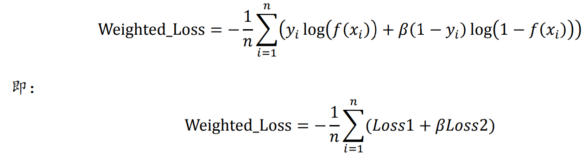
- 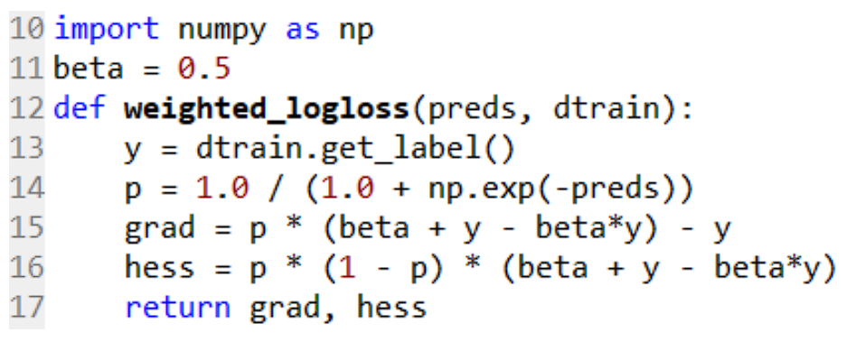

**General Loss:**
- 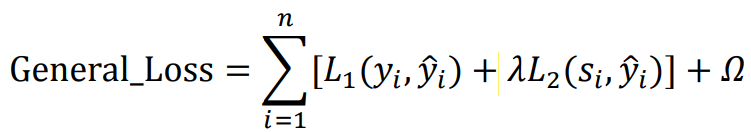
- 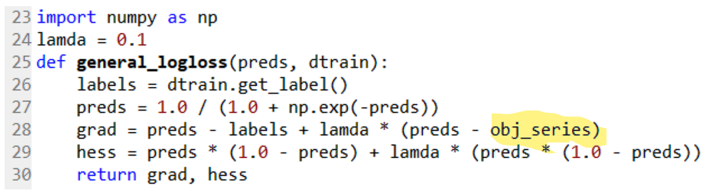

## 14, 16： Against overfitting-Train test split of Time series data
***
> How to determine overfitting?
> - Train loss decay while validation loss raise or maintain still

>Why we need special splitting method in Time series data?
> - Traditional K-fold validation split assumes that the data distribution is i.i.d. In time series data, clearly the features distribution varies from time to time.

**Time series cross-validation:**
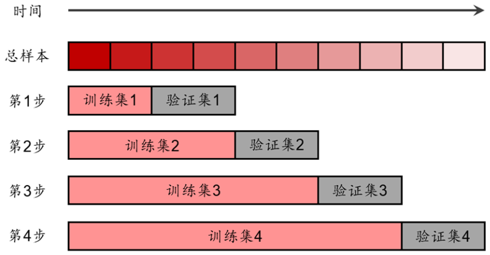
- Each model use different length-data to train and take the average metrics of validation set as model evaluation.

**Recursive Training:**
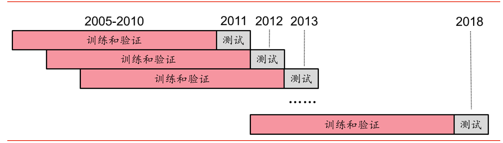

**Single Factor Testing:**
1. Get the factor's value of each stocks.
2. For each One-level industry, rank the corresponding stocks by the Factor Value.
3. The Weight of each stock is the same as their weight within the industry(or you can use the equal weight).
4. Split the industry stock into N folds. Since the stocks' weight is different, it is possible to have the same stock in different groups. And the weight of each stock in single group is also different.
5. The returns of the corresponding groups of different industries are weighted and summed according to the industry weight of the baseline portfolio(such as HS300), so as to obtain the final returns of different groups
**Such operation ensures that the factor's portfolio is also industry neutral.**
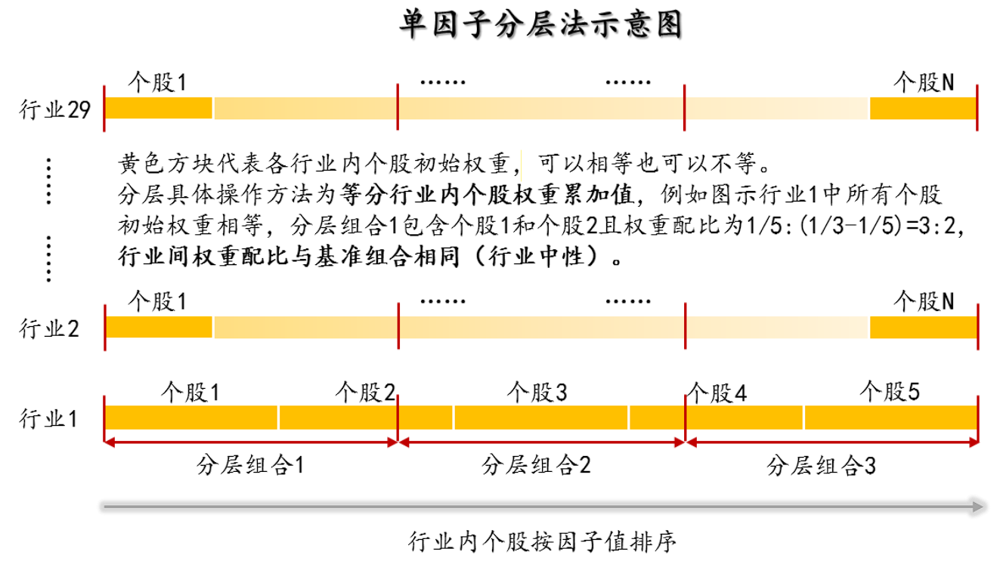

## 19: Against Overfitting: Bootstrap Method
***
> Key Idea: Using Bootstrap method to reconstruct the market, and test the model's sustainability or robustness.

**Three Bootstrapping way:**
- In-sample data bootstrap: use different data to train model
- Out-sample data bootstrap: use different data to test the robustness of model
- Time periods bootstrap: use different periods data to simulate different market, and test the model performance under different market environment.

**Key point:**
- This method is better used to compare  of different models or methods. You have to have the baseline model and then this method works, otherwise simple bootstrap doesn't mean anything.
- This method provide an different views of model's comparison.

## 31, 35: Against Overfitting: GAN, WGAN
***
> Key Idea: Introduced the GAN method, and use it to generate index series data(HS300). Then use the generated series to test the model's overfitting degree.

`Since I'm not familiar with GAN method. I'll check this report later after I figure out GAN model.`
TBW...

## 32, 34: AlphaNet-Using Deep-learning net to construct alpha feature
***
> Key Idea: Customize the CNN-like Layer design, which is essentially another way to implement the Genetic Algorithm, and use it to generate the feature.
> - Actually this is just the same as the gplearn-genetic algorithm. I don't really think this would work. 

In 34 report, they transfer the pooling and fc layer to lstm/gru layer. I don't think this two reports are really good.

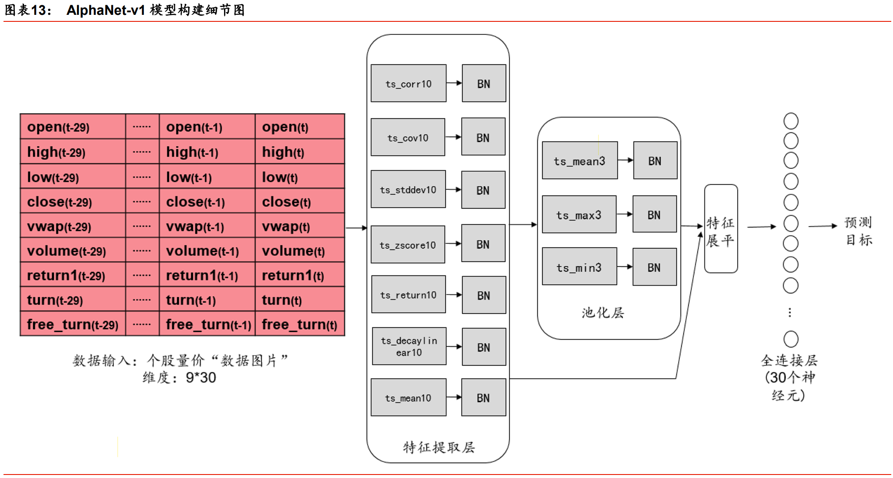

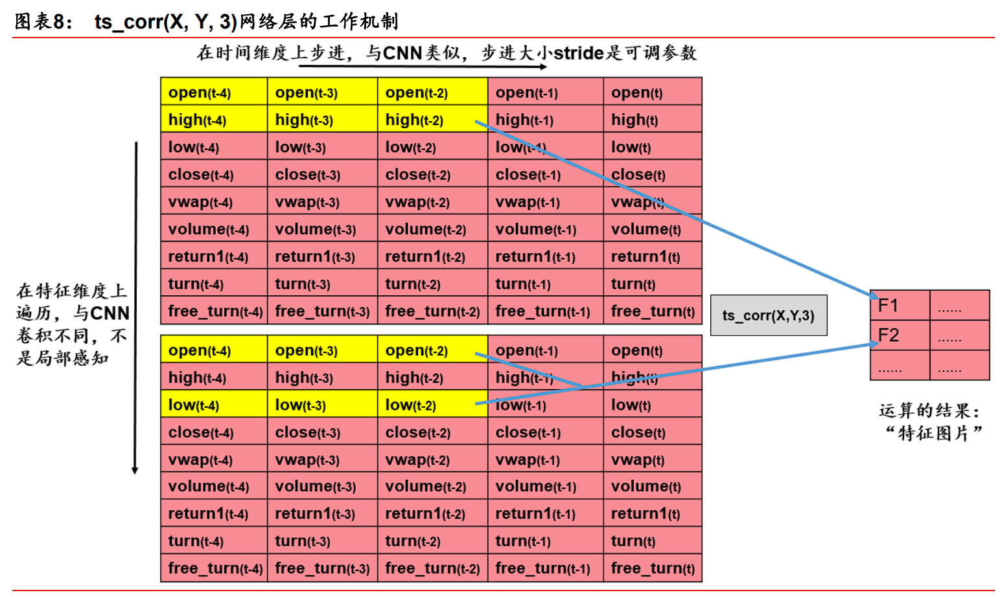

## 64: Ubiquant Kaggle Cmpetition
***
CCC Loss:
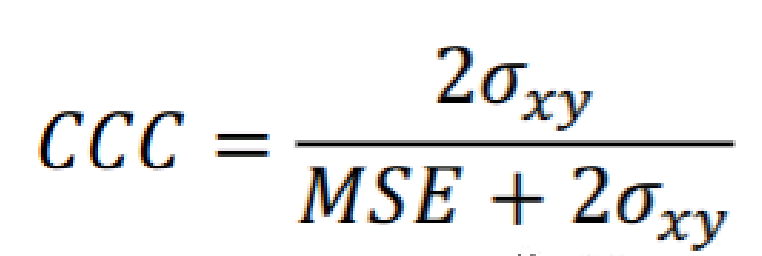

## 67: Multi-task Learning
***
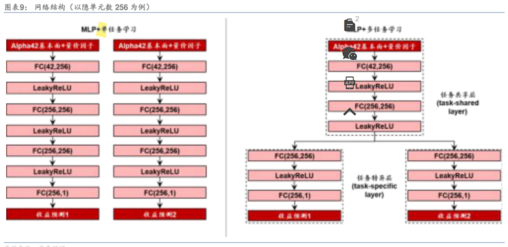

[使用pytorch实现MTL，多任务多目标学习 - 知乎 (zhihu.com)](https://zhuanlan.zhihu.com/p/351421350)
[Basic-Multi-task-Learning/MTL-Pytorch.ipynb at master · hosseinshn/Basic-Multi-task-Learning · GitHub](https://github.com/hosseinshn/Basic-Multi-task-Learning/blob/master/MTL-Pytorch.ipynb)

## Episode 68: Multi-frequency Learning
***
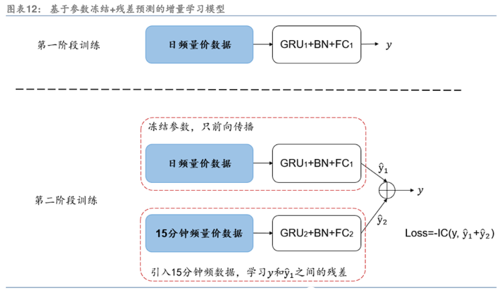

## 69: Attention
***
**股票间注意力:**
- (batch_size, seq_len, d_model) -> (交易日天数，不同股票，因子数量)
	- 需要提前padding：每天交易股票数量不同
	- attention模块就是计算股票间的相关性；
	- 无需position encoding：因为股票间顺序不关心；
	- 【问题】
		- 在做股票间transformer的时候，直接对截面因子做了multi-head，这样会有什么影响吗？因为对特征只计算了部分相关性，而不是全部；
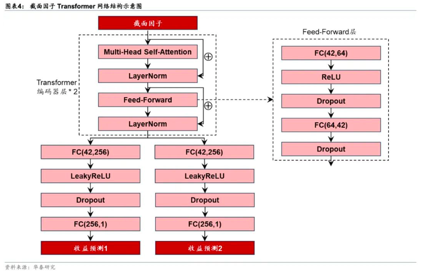

**时序注意力：**
- ALSTN, AGRU, Transformer
- (batch_size, seq_len, d_model) -> (股票个数，序列长度，因子数量)

**多任务注意力：**
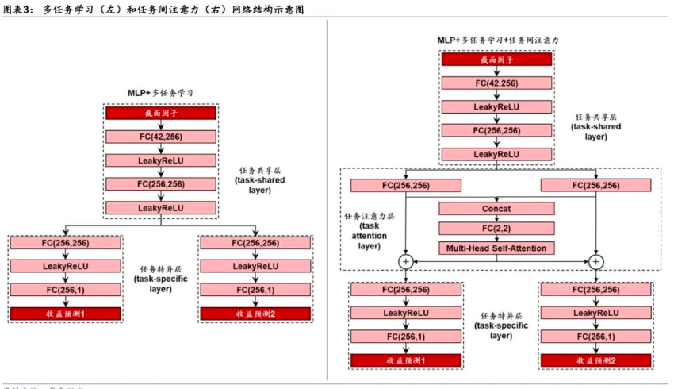

**集成注意力：**
- 用stacking集成上述模型
- 等权加权

【问题】
在做股票间transformer的时候，直接对截面因子做了multi-head，这样会有什么影响吗？因为对特征只计算了部分相关性，而不是全部；
