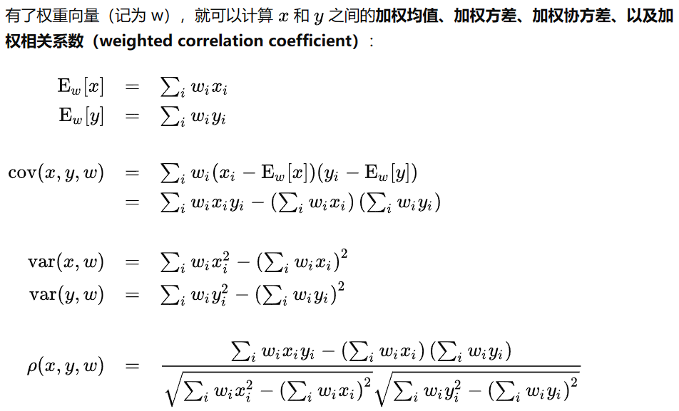

因子评价指标：

**IC：**
	相关系数
	一般大于0.03比较合适
**分组IC：**
将股票按因子分n组，按组的因子和组合收益率来算IC或RankIC
**加权IC：**
按照因子大小排序，然后给予指数衰减的权重，然后加权计算收益率。

[用 IC 评价因子效果靠谱吗？ - 知乎 (zhihu.com)](https://zhuanlan.zhihu.com/p/41454197)

**IR（信息比率）:**   
	IC均值/IC方差，描述因子的IC稳定性   
	一般大于0.5比较合适
**RankIC：**
	排序后的相关系数，corr('spearman')
**Calmar ratio：**
	收益/最大回撤，越大越好
**Sharp ratio：**
	超额收益/波动率
**分组多空收益率：**
查看分组收益情况
**正确率：**
因子历史的ic方向与均值ic方向相同的占比

**为什么用Lightgbm，优点在哪：**
1. 决策树模型，能够捕捉非线性特征：
	-  算出来的因子ic不高，不是强线性的
2. 速度更快，内存更小：
	- 使用直方图bin进行数据划分，而不像xgboost用数据点，不用记住每个样本的特征点，只用记得bin的分割点；
	- 因此数据更快，消耗内存更小，缓存友好；

[一篇文章搞定GBDT、Xgboost和LightGBM的面试 - 知乎 (zhihu.com)](https://zhuanlan.zhihu.com/p/148050748)

[从面试的角度来了解GBDT,XGB,Lightgbm - 知乎 (zhihu.com)](https://zhuanlan.zhihu.com/p/577209647)

**怎么做的：**
1. 因子挖掘；
2. 因子检验，处理，归一化；
3. 训练集、测试集划分； 大概千万级别的数据
4. 
